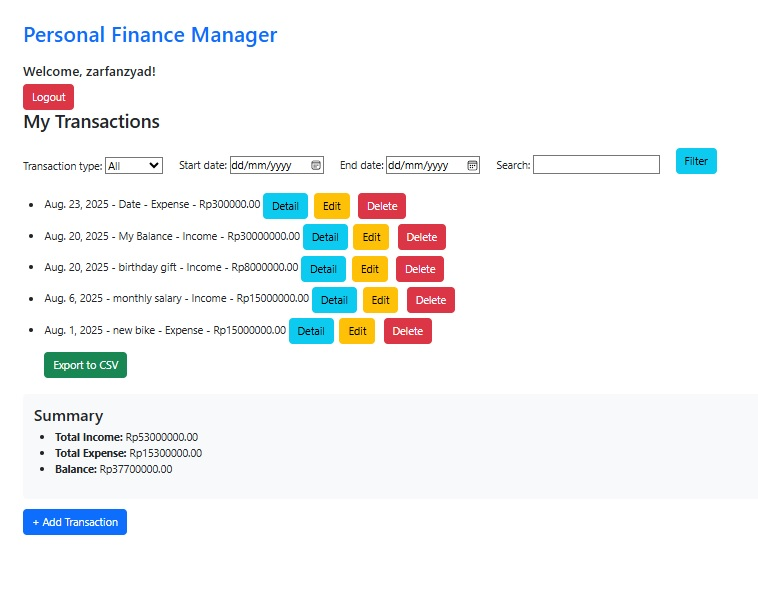
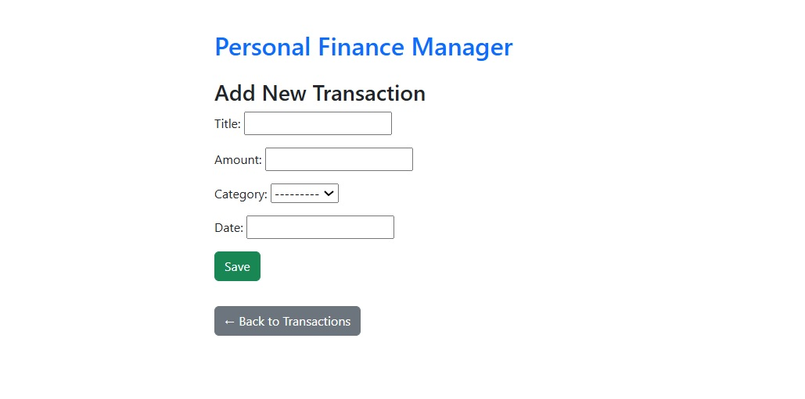

# 💰 Personal Finance Manager — Web-Based Expense Tracker with Multi-User Support

A full-featured personal finance tracking web application built using Django and MySQL. This upgraded version supports multi-user login, allowing each user to manage and export their own income and expense records securely. The project also implements clean UI sections and interactive forms using Bootstrap.

## 📌 Features

-Multi-user support using Django's built-in authentication system
-Add, edit, delete, and view transactions
-Filter transactions by type, date range, and keyword (horizontal layout)
-Live summary dashboard: total income, total expense, and balance
-CSV export of user-specific transaction data
-MySQL database integration using environment variables (.env)
-Responsive UI using Bootstrap, with separated HTML templates per view
-Login & Register system with redirects to main dashboard after login
-Custom detail pages for each transaction (CRUD)
-Django messages framework for action feedback (add/update/delete)

## 🛠️ Tech Stack

- Backend: Django (Python)
- Database: MySQL
- Frontend: HTML, Bootstrap
- Others: Python Dotenv, Django ORM, Git

## ⚙️ Setup Instructions
  
  1. Clone the repository
     
  ```
   git clone https://github.com/yourusername/personal-finance-manager.git
   cd personal-finance-manager
   ```

  2. Create a virtual environment
     
    
    python -m venv .venv
    source .venv/bin/activate        # On Windows: .venv\Scripts\activate
    
    
  3. Install dependencies

       
    pip install -r requirements.txt
    
    
  4. Set up environment variables
     Create a .env file in the project root and define:
     
    
    SECRET_KEY=your_secret_key_here
    NAME=your_mysql_db_name
    USER=your_mysql_user
    PASSWORD=your_mysql_password
    HOST=localhost
    PORT=3306
    
  
  5. Run migrations

    
    python manage.py makemigrations
    python manage.py migrate
    
 
  6. Run the development server
    Access the app at: http://localhost:8000

    
    python manage.py runserver
    
    
## 📁 Project Structure
    
    personal_finance_manager/
    ├── config/              # Django project settings
    ├── tracker/             # App for managing transactions
    ├── templates/           # HTML templates
    ├── .env                 # Environment variables
    ├── requirements.txt     # Python dependencies
    └── manage.py
    

## 🧠 What I Learned
  1.Structuring scalable Django projects with app separation (tracker/)
  2.Connecting Django to MySQL using mysqlclient and .env securely
  3.Building dynamic filters and aggregate queries with Django ORM
  4.Implementing user-based data filtering for privacy
  5.Creating reusable and responsive templates with Bootstrap
  6.Managing Django user sessions and redirection securely

## 📌 Future Improvements
  1. Add user authentication and profiles
  2. Visualization with charts for spending/income
  3. Monthly summaries
  4. REST API integration

##📷 Screenshots





   
